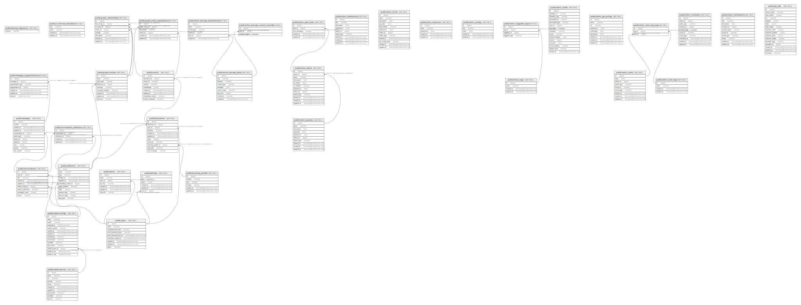

# archyve_development

## Tables

| Name | Columns | Comment | Type |
| ---- | ------- | ------- | ---- |
| [public.schema_migrations](public.schema_migrations.md) | 1 |  | BASE TABLE |
| [public.ar_internal_metadata](public.ar_internal_metadata.md) | 4 |  | BASE TABLE |
| [public.users](public.users.md) | 9 |  | BASE TABLE |
| [public.model_servers](public.model_servers.md) | 10 |  | BASE TABLE |
| [public.model_configs](public.model_configs.md) | 14 |  | BASE TABLE |
| [public.messages](public.messages.md) | 11 |  | BASE TABLE |
| [public.conversations](public.conversations.md) | 9 |  | BASE TABLE |
| [public.active_storage_blobs](public.active_storage_blobs.md) | 9 |  | BASE TABLE |
| [public.active_storage_attachments](public.active_storage_attachments.md) | 6 |  | BASE TABLE |
| [public.active_storage_variant_records](public.active_storage_variant_records.md) | 3 |  | BASE TABLE |
| [public.collections](public.collections.md) | 11 |  | BASE TABLE |
| [public.documents](public.documents.md) | 11 |  | BASE TABLE |
| [public.chunks](public.chunks.md) | 9 |  | BASE TABLE |
| [public.conversation_collections](public.conversation_collections.md) | 5 |  | BASE TABLE |
| [public.clients](public.clients.md) | 7 |  | BASE TABLE |
| [public.chunking_profiles](public.chunking_profiles.md) | 6 |  | BASE TABLE |
| [public.motor_queries](public.motor_queries.md) | 10 |  | BASE TABLE |
| [public.motor_dashboards](public.motor_dashboards.md) | 9 |  | BASE TABLE |
| [public.motor_forms](public.motor_forms.md) | 12 |  | BASE TABLE |
| [public.motor_resources](public.motor_resources.md) | 5 |  | BASE TABLE |
| [public.motor_configs](public.motor_configs.md) | 5 |  | BASE TABLE |
| [public.motor_alerts](public.motor_alerts.md) | 12 |  | BASE TABLE |
| [public.motor_alert_locks](public.motor_alert_locks.md) | 5 |  | BASE TABLE |
| [public.motor_tags](public.motor_tags.md) | 4 |  | BASE TABLE |
| [public.motor_taggable_tags](public.motor_taggable_tags.md) | 4 |  | BASE TABLE |
| [public.motor_audits](public.motor_audits.md) | 15 |  | BASE TABLE |
| [public.motor_api_configs](public.motor_api_configs.md) | 9 |  | BASE TABLE |
| [public.motor_notes](public.motor_notes.md) | 9 |  | BASE TABLE |
| [public.motor_note_tags](public.motor_note_tags.md) | 4 |  | BASE TABLE |
| [public.motor_note_tag_tags](public.motor_note_tag_tags.md) | 3 |  | BASE TABLE |
| [public.motor_reminders](public.motor_reminders.md) | 10 |  | BASE TABLE |
| [public.motor_notifications](public.motor_notifications.md) | 10 |  | BASE TABLE |
| [public.settings](public.settings.md) | 6 |  | BASE TABLE |
| [public.api_calls](public.api_calls.md) | 16 |  | BASE TABLE |
| [public.graph_entities](public.graph_entities.md) | 9 |  | BASE TABLE |
| [public.graph_entity_descriptions](public.graph_entity_descriptions.md) | 6 |  | BASE TABLE |
| [public.graph_relationships](public.graph_relationships.md) | 8 |  | BASE TABLE |
| [public.message_augmentations](public.message_augmentations.md) | 7 |  | BASE TABLE |

## Relations

---

> Generated by [tbls](https://github.com/k1LoW/tbls)
