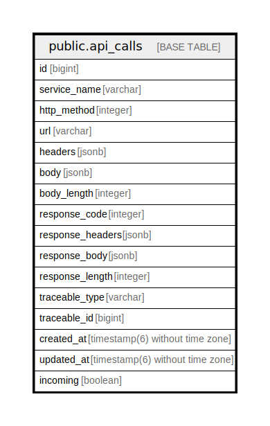

# public.api_calls

## Description

## Columns

| Name | Type | Default | Nullable | Children | Parents | Comment |
| ---- | ---- | ------- | -------- | -------- | ------- | ------- |
| id | bigint | nextval('api_calls_id_seq'::regclass) | false |  |  |  |
| service_name | varchar |  | true |  |  |  |
| http_method | integer |  | true |  |  |  |
| url | varchar |  | true |  |  |  |
| headers | jsonb |  | true |  |  |  |
| body | jsonb |  | true |  |  |  |
| body_length | integer |  | true |  |  |  |
| response_code | integer |  | true |  |  |  |
| response_headers | jsonb |  | true |  |  |  |
| response_body | jsonb |  | true |  |  |  |
| response_length | integer |  | true |  |  |  |
| traceable_type | varchar |  | true |  |  |  |
| traceable_id | bigint |  | true |  |  |  |
| created_at | timestamp(6) without time zone |  | false |  |  |  |
| updated_at | timestamp(6) without time zone |  | false |  |  |  |
| incoming | boolean | false | true |  |  |  |

## Constraints

| Name | Type | Definition |
| ---- | ---- | ---------- |
| api_calls_pkey | PRIMARY KEY | PRIMARY KEY (id) |

## Indexes

| Name | Definition |
| ---- | ---------- |
| api_calls_pkey | CREATE UNIQUE INDEX api_calls_pkey ON public.api_calls USING btree (id) |
| index_api_calls_on_traceable | CREATE INDEX index_api_calls_on_traceable ON public.api_calls USING btree (traceable_type, traceable_id) |

## Relations

---

> Generated by [tbls](https://github.com/k1LoW/tbls)
