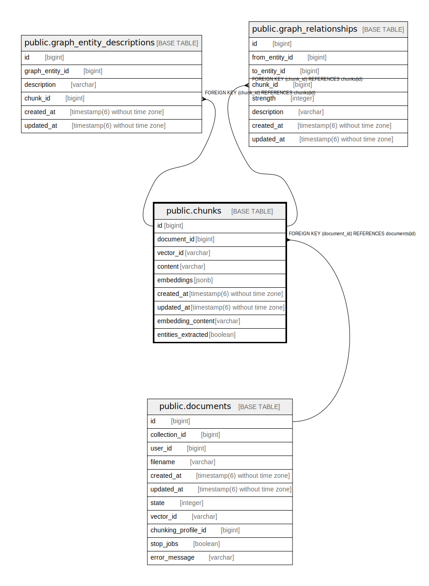

# public.chunks

## Description

## Columns

| Name | Type | Default | Nullable | Children | Parents | Comment |
| ---- | ---- | ------- | -------- | -------- | ------- | ------- |
| id | bigint | nextval('chunks_id_seq'::regclass) | false | [public.graph_entity_descriptions](public.graph_entity_descriptions.md) [public.graph_relationships](public.graph_relationships.md) |  |  |
| document_id | bigint |  | false |  | [public.documents](public.documents.md) |  |
| vector_id | varchar |  | true |  |  |  |
| content | varchar |  | true |  |  |  |
| embeddings | jsonb |  | true |  |  |  |
| created_at | timestamp(6) without time zone |  | false |  |  |  |
| updated_at | timestamp(6) without time zone |  | false |  |  |  |
| embedding_content | varchar |  | true |  |  |  |
| entities_extracted | boolean | false | true |  |  |  |

## Constraints

| Name | Type | Definition |
| ---- | ---- | ---------- |
| fk_rails_1dac2f17d2 | FOREIGN KEY | FOREIGN KEY (document_id) REFERENCES documents(id) |
| chunks_pkey | PRIMARY KEY | PRIMARY KEY (id) |

## Indexes

| Name | Definition |
| ---- | ---------- |
| chunks_pkey | CREATE UNIQUE INDEX chunks_pkey ON public.chunks USING btree (id) |
| index_chunks_on_document_id | CREATE INDEX index_chunks_on_document_id ON public.chunks USING btree (document_id) |

## Relations

---

> Generated by [tbls](https://github.com/k1LoW/tbls)
