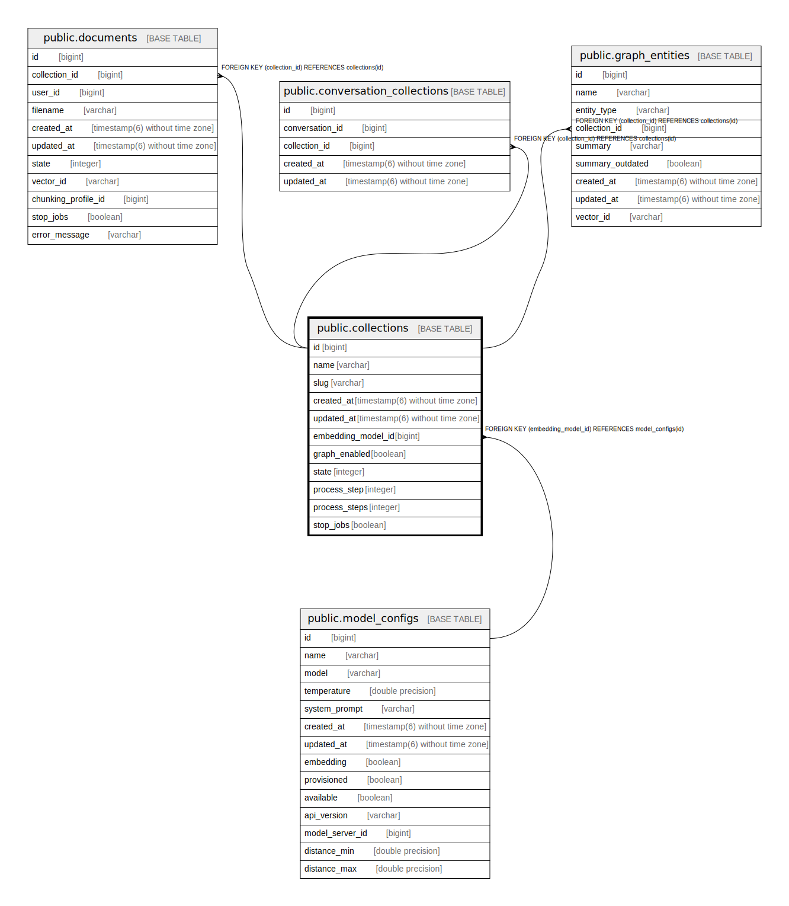

# public.collections

## Description

## Columns

| Name | Type | Default | Nullable | Children | Parents | Comment |
| ---- | ---- | ------- | -------- | -------- | ------- | ------- |
| id | bigint | nextval('collections_id_seq'::regclass) | false | [public.documents](public.documents.md) [public.conversation_collections](public.conversation_collections.md) [public.graph_entities](public.graph_entities.md) |  |  |
| name | varchar |  | true |  |  |  |
| slug | varchar |  | true |  |  |  |
| created_at | timestamp(6) without time zone |  | false |  |  |  |
| updated_at | timestamp(6) without time zone |  | false |  |  |  |
| embedding_model_id | bigint |  | false |  | [public.model_configs](public.model_configs.md) |  |
| graph_enabled | boolean | false | true |  |  |  |
| state | integer | 0 | true |  |  |  |
| process_step | integer |  | true |  |  |  |
| process_steps | integer |  | true |  |  |  |
| stop_jobs | boolean | false | true |  |  |  |

## Constraints

| Name | Type | Definition |
| ---- | ---- | ---------- |
| fk_rails_50aaf52fa3 | FOREIGN KEY | FOREIGN KEY (embedding_model_id) REFERENCES model_configs(id) |
| collections_pkey | PRIMARY KEY | PRIMARY KEY (id) |

## Indexes

| Name | Definition |
| ---- | ---------- |
| collections_pkey | CREATE UNIQUE INDEX collections_pkey ON public.collections USING btree (id) |
| index_collections_on_embedding_model_id | CREATE INDEX index_collections_on_embedding_model_id ON public.collections USING btree (embedding_model_id) |

## Relations

---

> Generated by [tbls](https://github.com/k1LoW/tbls)
