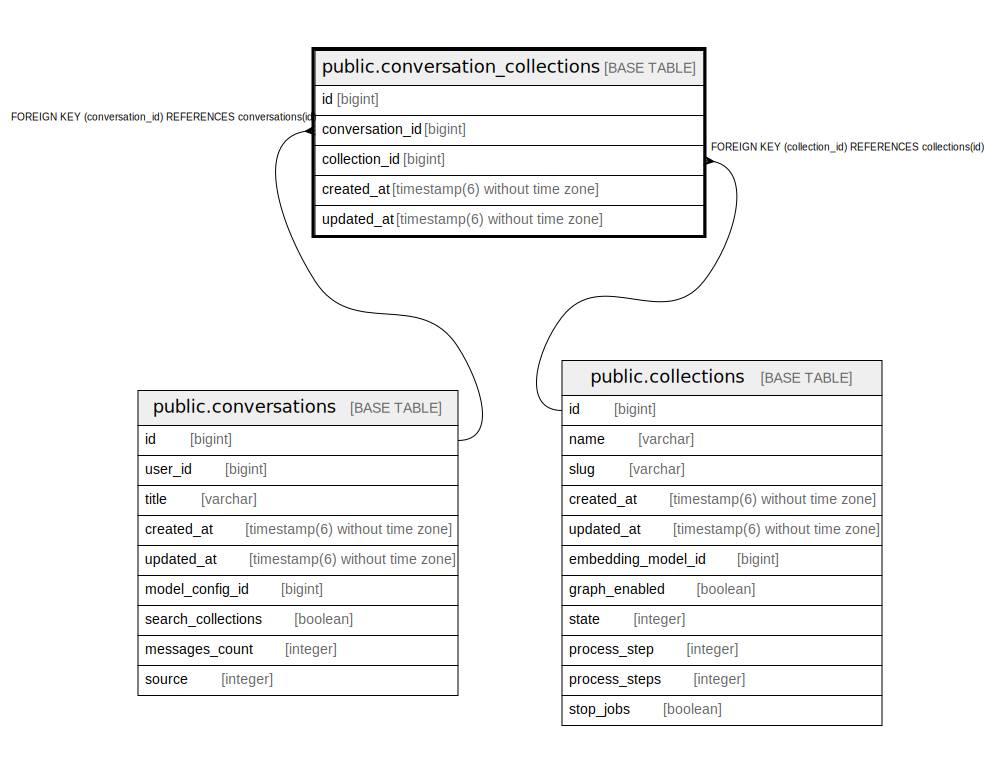

# public.conversation_collections

## Description

## Columns

| Name | Type | Default | Nullable | Children | Parents | Comment |
| ---- | ---- | ------- | -------- | -------- | ------- | ------- |
| id | bigint | nextval('conversation_collections_id_seq'::regclass) | false |  |  |  |
| conversation_id | bigint |  | false |  | [public.conversations](public.conversations.md) |  |
| collection_id | bigint |  | false |  | [public.collections](public.collections.md) |  |
| created_at | timestamp(6) without time zone |  | false |  |  |  |
| updated_at | timestamp(6) without time zone |  | false |  |  |  |

## Constraints

| Name | Type | Definition |
| ---- | ---- | ---------- |
| fk_rails_33646978a0 | FOREIGN KEY | FOREIGN KEY (conversation_id) REFERENCES conversations(id) |
| fk_rails_3aabda7a36 | FOREIGN KEY | FOREIGN KEY (collection_id) REFERENCES collections(id) |
| conversation_collections_pkey | PRIMARY KEY | PRIMARY KEY (id) |

## Indexes

| Name | Definition |
| ---- | ---------- |
| conversation_collections_pkey | CREATE UNIQUE INDEX conversation_collections_pkey ON public.conversation_collections USING btree (id) |
| index_conversation_collections_on_conversation_id | CREATE INDEX index_conversation_collections_on_conversation_id ON public.conversation_collections USING btree (conversation_id) |
| index_conversation_collections_on_collection_id | CREATE INDEX index_conversation_collections_on_collection_id ON public.conversation_collections USING btree (collection_id) |

## Relations

---

> Generated by [tbls](https://github.com/k1LoW/tbls)
