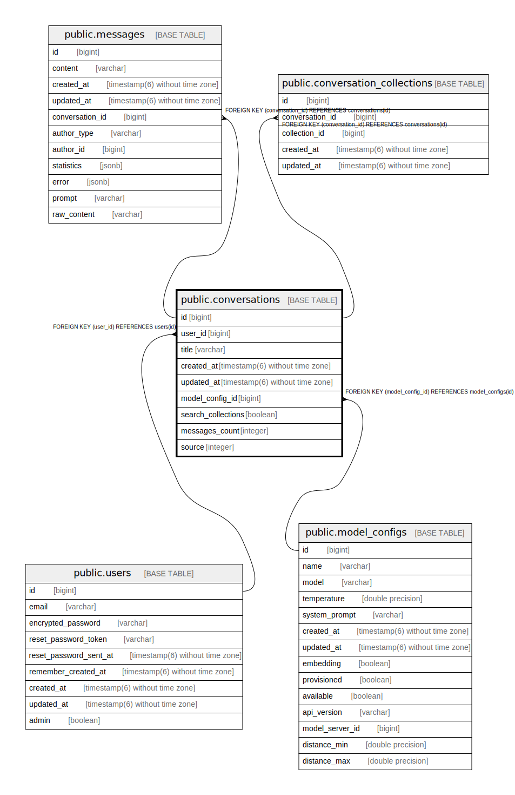

# public.conversations

## Description

## Columns

| Name | Type | Default | Nullable | Children | Parents | Comment |
| ---- | ---- | ------- | -------- | -------- | ------- | ------- |
| id | bigint | nextval('conversations_id_seq'::regclass) | false | [public.messages](public.messages.md) [public.conversation_collections](public.conversation_collections.md) |  |  |
| user_id | bigint |  | false |  | [public.users](public.users.md) |  |
| title | varchar |  | true |  |  |  |
| created_at | timestamp(6) without time zone |  | false |  |  |  |
| updated_at | timestamp(6) without time zone |  | false |  |  |  |
| model_config_id | bigint |  | false |  | [public.model_configs](public.model_configs.md) |  |
| search_collections | boolean | true | true |  |  |  |
| messages_count | integer |  | true |  |  |  |
| source | integer |  | true |  |  |  |

## Constraints

| Name | Type | Definition |
| ---- | ---- | ---------- |
| fk_rails_7c15d62a0a | FOREIGN KEY | FOREIGN KEY (user_id) REFERENCES users(id) |
| fk_rails_a63a240fe4 | FOREIGN KEY | FOREIGN KEY (model_config_id) REFERENCES model_configs(id) |
| conversations_pkey | PRIMARY KEY | PRIMARY KEY (id) |

## Indexes

| Name | Definition |
| ---- | ---------- |
| conversations_pkey | CREATE UNIQUE INDEX conversations_pkey ON public.conversations USING btree (id) |
| index_conversations_on_user_id | CREATE INDEX index_conversations_on_user_id ON public.conversations USING btree (user_id) |
| index_conversations_on_model_config_id | CREATE INDEX index_conversations_on_model_config_id ON public.conversations USING btree (model_config_id) |

## Relations

---

> Generated by [tbls](https://github.com/k1LoW/tbls)
