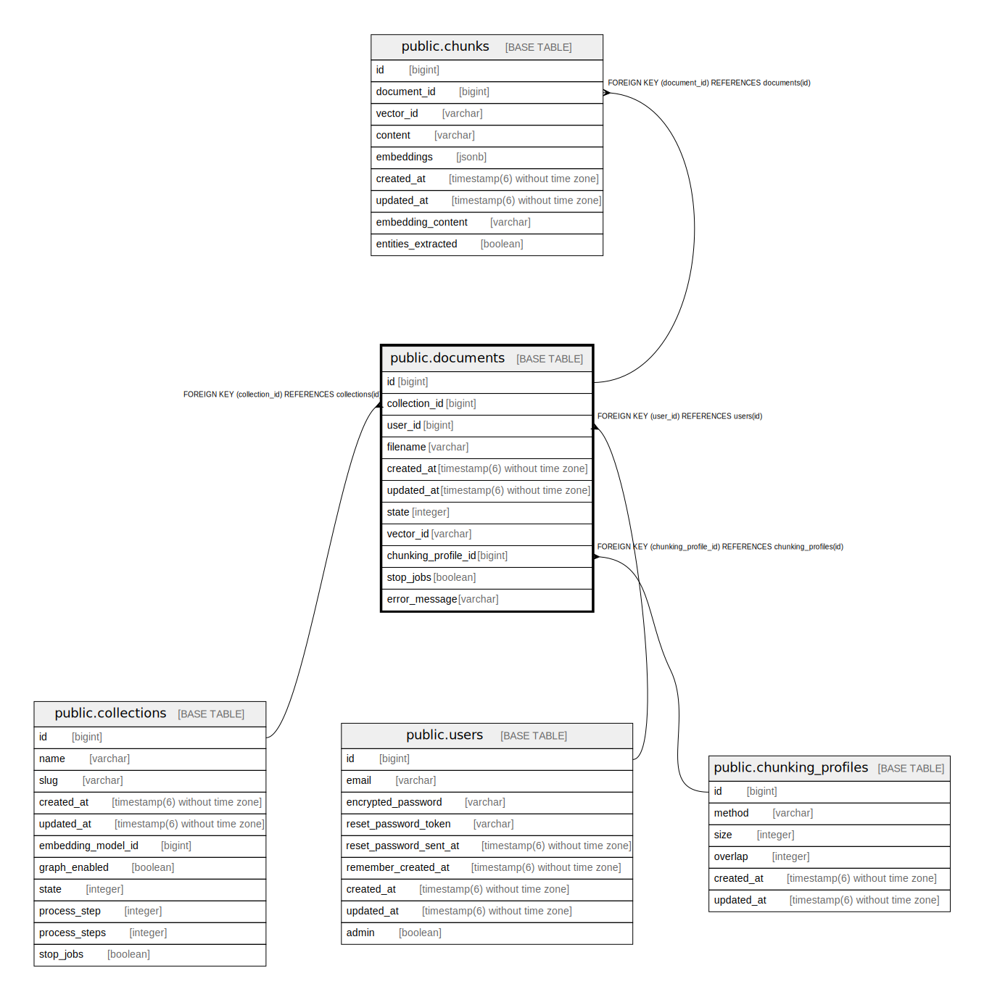

# public.documents

## Description

## Columns

| Name | Type | Default | Nullable | Children | Parents | Comment |
| ---- | ---- | ------- | -------- | -------- | ------- | ------- |
| id | bigint | nextval('documents_id_seq'::regclass) | false | [public.chunks](public.chunks.md) |  |  |
| collection_id | bigint |  | false |  | [public.collections](public.collections.md) |  |
| user_id | bigint |  | false |  | [public.users](public.users.md) |  |
| filename | varchar |  | true |  |  |  |
| created_at | timestamp(6) without time zone |  | false |  |  |  |
| updated_at | timestamp(6) without time zone |  | false |  |  |  |
| state | integer |  | true |  |  |  |
| vector_id | varchar |  | true |  |  |  |
| chunking_profile_id | bigint |  | true |  | [public.chunking_profiles](public.chunking_profiles.md) |  |
| stop_jobs | boolean | false | true |  |  |  |
| error_message | varchar |  | true |  |  |  |

## Constraints

| Name | Type | Definition |
| ---- | ---- | ---------- |
| fk_rails_2be0318c46 | FOREIGN KEY | FOREIGN KEY (user_id) REFERENCES users(id) |
| fk_rails_d1954ada41 | FOREIGN KEY | FOREIGN KEY (collection_id) REFERENCES collections(id) |
| documents_pkey | PRIMARY KEY | PRIMARY KEY (id) |
| fk_rails_da217bdecb | FOREIGN KEY | FOREIGN KEY (chunking_profile_id) REFERENCES chunking_profiles(id) |

## Indexes

| Name | Definition |
| ---- | ---------- |
| documents_pkey | CREATE UNIQUE INDEX documents_pkey ON public.documents USING btree (id) |
| index_documents_on_collection_id | CREATE INDEX index_documents_on_collection_id ON public.documents USING btree (collection_id) |
| index_documents_on_user_id | CREATE INDEX index_documents_on_user_id ON public.documents USING btree (user_id) |
| index_documents_on_chunking_profile_id | CREATE INDEX index_documents_on_chunking_profile_id ON public.documents USING btree (chunking_profile_id) |

## Relations

---

> Generated by [tbls](https://github.com/k1LoW/tbls)
