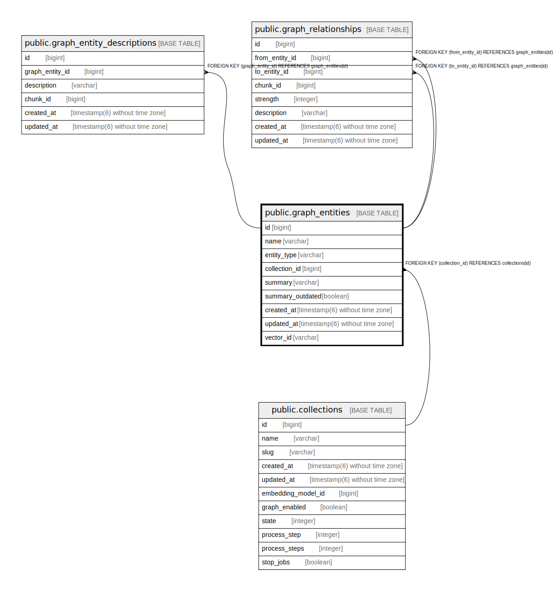

# public.graph_entities

## Description

## Columns

| Name | Type | Default | Nullable | Children | Parents | Comment |
| ---- | ---- | ------- | -------- | -------- | ------- | ------- |
| id | bigint | nextval('graph_entities_id_seq'::regclass) | false | [public.graph_entity_descriptions](public.graph_entity_descriptions.md) [public.graph_relationships](public.graph_relationships.md) |  |  |
| name | varchar |  | true |  |  |  |
| entity_type | varchar |  | true |  |  |  |
| collection_id | bigint |  | false |  | [public.collections](public.collections.md) |  |
| summary | varchar |  | true |  |  |  |
| summary_outdated | boolean |  | true |  |  |  |
| created_at | timestamp(6) without time zone |  | false |  |  |  |
| updated_at | timestamp(6) without time zone |  | false |  |  |  |
| vector_id | varchar |  | true |  |  |  |

## Constraints

| Name | Type | Definition |
| ---- | ---- | ---------- |
| fk_rails_d5ac465d86 | FOREIGN KEY | FOREIGN KEY (collection_id) REFERENCES collections(id) |
| graph_entities_pkey | PRIMARY KEY | PRIMARY KEY (id) |

## Indexes

| Name | Definition |
| ---- | ---------- |
| graph_entities_pkey | CREATE UNIQUE INDEX graph_entities_pkey ON public.graph_entities USING btree (id) |
| index_graph_entities_on_collection_id | CREATE INDEX index_graph_entities_on_collection_id ON public.graph_entities USING btree (collection_id) |

## Relations

---

> Generated by [tbls](https://github.com/k1LoW/tbls)
