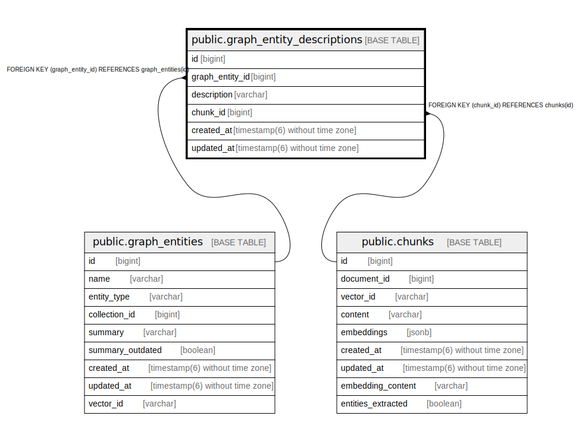

# public.graph_entity_descriptions

## Description

## Columns

| Name | Type | Default | Nullable | Children | Parents | Comment |
| ---- | ---- | ------- | -------- | -------- | ------- | ------- |
| id | bigint | nextval('graph_entity_descriptions_id_seq'::regclass) | false |  |  |  |
| graph_entity_id | bigint |  | false |  | [public.graph_entities](public.graph_entities.md) |  |
| description | varchar |  | true |  |  |  |
| chunk_id | bigint |  | false |  | [public.chunks](public.chunks.md) |  |
| created_at | timestamp(6) without time zone |  | false |  |  |  |
| updated_at | timestamp(6) without time zone |  | false |  |  |  |

## Constraints

| Name | Type | Definition |
| ---- | ---- | ---------- |
| fk_rails_4c1be7c2f9 | FOREIGN KEY | FOREIGN KEY (chunk_id) REFERENCES chunks(id) |
| fk_rails_0ff5fb7821 | FOREIGN KEY | FOREIGN KEY (graph_entity_id) REFERENCES graph_entities(id) |
| graph_entity_descriptions_pkey | PRIMARY KEY | PRIMARY KEY (id) |

## Indexes

| Name | Definition |
| ---- | ---------- |
| graph_entity_descriptions_pkey | CREATE UNIQUE INDEX graph_entity_descriptions_pkey ON public.graph_entity_descriptions USING btree (id) |
| index_graph_entity_descriptions_on_graph_entity_id | CREATE INDEX index_graph_entity_descriptions_on_graph_entity_id ON public.graph_entity_descriptions USING btree (graph_entity_id) |
| index_graph_entity_descriptions_on_chunk_id | CREATE INDEX index_graph_entity_descriptions_on_chunk_id ON public.graph_entity_descriptions USING btree (chunk_id) |

## Relations

---

> Generated by [tbls](https://github.com/k1LoW/tbls)
