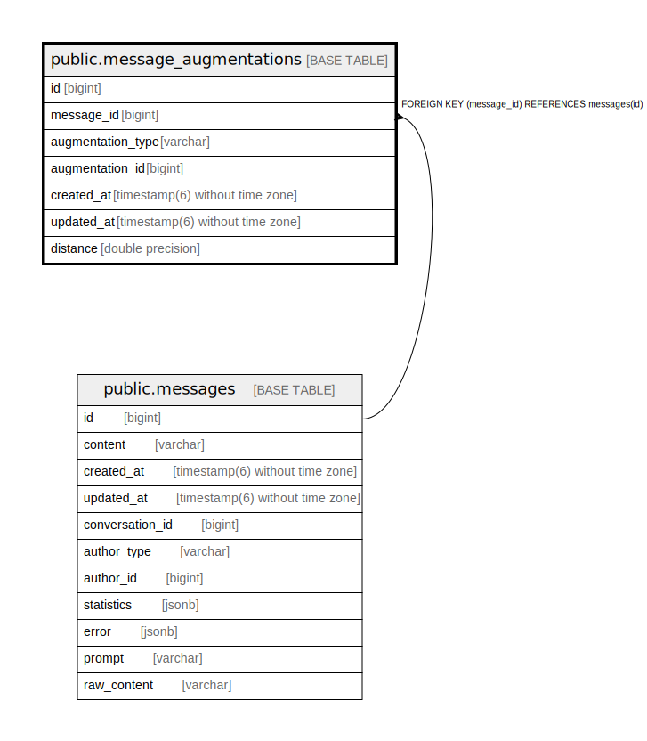

# public.message_augmentations

## Description

## Columns

| Name | Type | Default | Nullable | Children | Parents | Comment |
| ---- | ---- | ------- | -------- | -------- | ------- | ------- |
| id | bigint | nextval('message_augmentations_id_seq'::regclass) | false |  |  |  |
| message_id | bigint |  | false |  | [public.messages](public.messages.md) |  |
| augmentation_type | varchar |  | false |  |  |  |
| augmentation_id | bigint |  | false |  |  |  |
| created_at | timestamp(6) without time zone |  | false |  |  |  |
| updated_at | timestamp(6) without time zone |  | false |  |  |  |
| distance | double precision |  | true |  |  |  |

## Constraints

| Name | Type | Definition |
| ---- | ---- | ---------- |
| fk_rails_ba24191e90 | FOREIGN KEY | FOREIGN KEY (message_id) REFERENCES messages(id) |
| message_augmentations_pkey | PRIMARY KEY | PRIMARY KEY (id) |

## Indexes

| Name | Definition |
| ---- | ---------- |
| message_augmentations_pkey | CREATE UNIQUE INDEX message_augmentations_pkey ON public.message_augmentations USING btree (id) |
| index_message_augmentations_on_message_id | CREATE INDEX index_message_augmentations_on_message_id ON public.message_augmentations USING btree (message_id) |
| index_message_augmentations_on_augmentation | CREATE INDEX index_message_augmentations_on_augmentation ON public.message_augmentations USING btree (augmentation_type, augmentation_id) |

## Relations

---

> Generated by [tbls](https://github.com/k1LoW/tbls)
