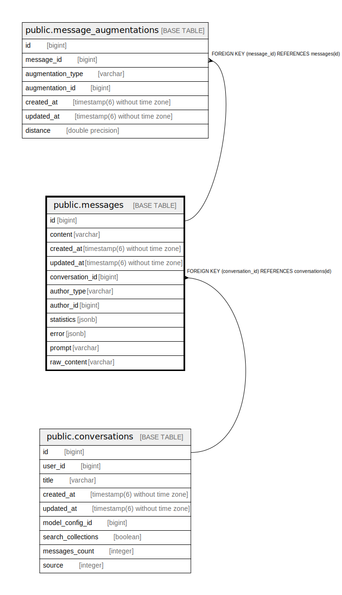

# public.messages

## Description

## Columns

| Name | Type | Default | Nullable | Children | Parents | Comment |
| ---- | ---- | ------- | -------- | -------- | ------- | ------- |
| id | bigint | nextval('messages_id_seq'::regclass) | false | [public.message_augmentations](public.message_augmentations.md) |  |  |
| content | varchar |  | true |  |  |  |
| created_at | timestamp(6) without time zone |  | false |  |  |  |
| updated_at | timestamp(6) without time zone |  | false |  |  |  |
| conversation_id | bigint |  | false |  | [public.conversations](public.conversations.md) |  |
| author_type | varchar |  | true |  |  |  |
| author_id | bigint |  | false |  |  |  |
| statistics | jsonb |  | true |  |  |  |
| error | jsonb |  | true |  |  |  |
| prompt | varchar |  | true |  |  |  |
| raw_content | varchar |  | true |  |  |  |

## Constraints

| Name | Type | Definition |
| ---- | ---- | ---------- |
| messages_pkey | PRIMARY KEY | PRIMARY KEY (id) |
| fk_rails_7f927086d2 | FOREIGN KEY | FOREIGN KEY (conversation_id) REFERENCES conversations(id) |

## Indexes

| Name | Definition |
| ---- | ---------- |
| messages_pkey | CREATE UNIQUE INDEX messages_pkey ON public.messages USING btree (id) |
| index_messages_on_conversation_id | CREATE INDEX index_messages_on_conversation_id ON public.messages USING btree (conversation_id) |
| index_messages_on_author | CREATE INDEX index_messages_on_author ON public.messages USING btree (author_type, author_id) |

## Relations

---

> Generated by [tbls](https://github.com/k1LoW/tbls)
