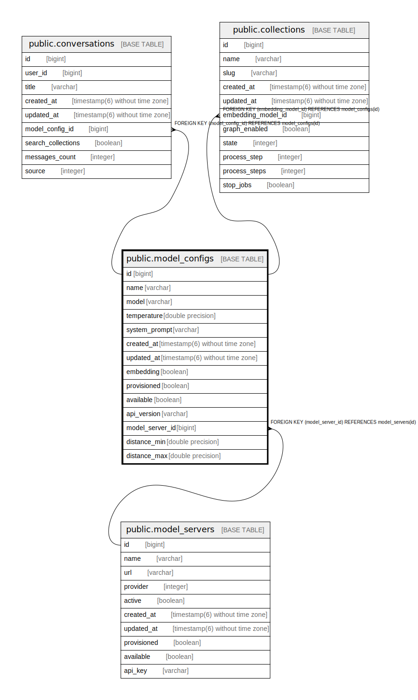

# public.model_configs

## Description

## Columns

| Name | Type | Default | Nullable | Children | Parents | Comment |
| ---- | ---- | ------- | -------- | -------- | ------- | ------- |
| id | bigint | nextval('model_configs_id_seq'::regclass) | false | [public.conversations](public.conversations.md) [public.collections](public.collections.md) |  |  |
| name | varchar |  | true |  |  |  |
| model | varchar |  | true |  |  |  |
| temperature | double precision |  | true |  |  |  |
| system_prompt | varchar |  | true |  |  |  |
| created_at | timestamp(6) without time zone |  | false |  |  |  |
| updated_at | timestamp(6) without time zone |  | false |  |  |  |
| embedding | boolean | false | true |  |  |  |
| provisioned | boolean | false | true |  |  |  |
| available | boolean | true | true |  |  |  |
| api_version | varchar |  | true |  |  |  |
| model_server_id | bigint |  | true |  | [public.model_servers](public.model_servers.md) |  |
| distance_min | double precision |  | true |  |  |  |
| distance_max | double precision |  | true |  |  |  |

## Constraints

| Name | Type | Definition |
| ---- | ---- | ---------- |
| fk_rails_56402d547b | FOREIGN KEY | FOREIGN KEY (model_server_id) REFERENCES model_servers(id) |
| model_configs_pkey | PRIMARY KEY | PRIMARY KEY (id) |

## Indexes

| Name | Definition |
| ---- | ---------- |
| model_configs_pkey | CREATE UNIQUE INDEX model_configs_pkey ON public.model_configs USING btree (id) |
| index_model_configs_on_model_server_id | CREATE INDEX index_model_configs_on_model_server_id ON public.model_configs USING btree (model_server_id) |

## Relations

---

> Generated by [tbls](https://github.com/k1LoW/tbls)
