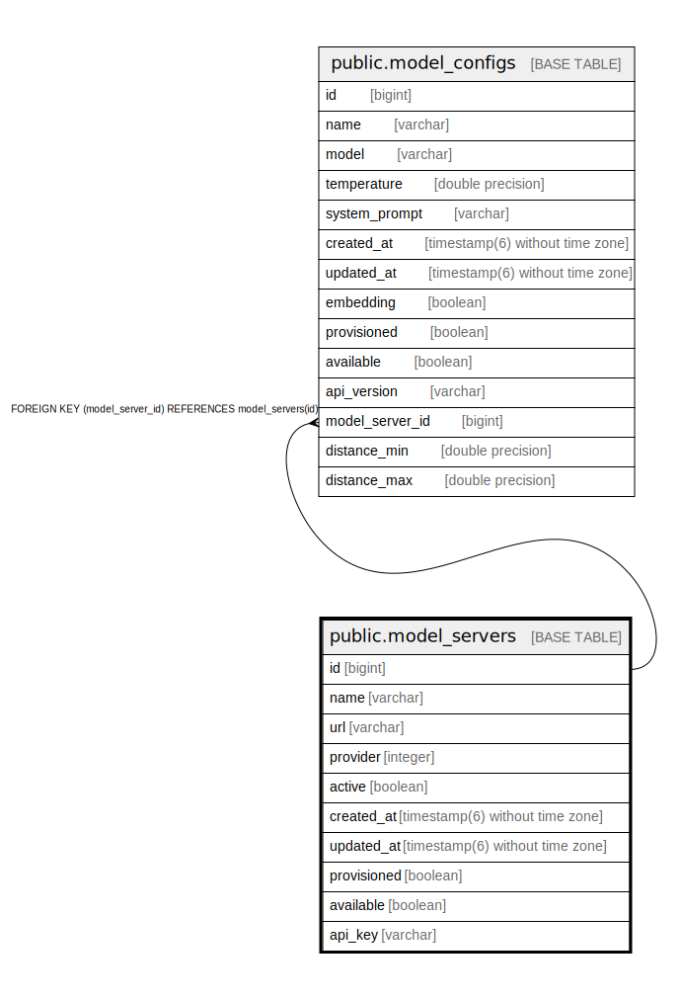

# public.model_servers

## Description

## Columns

| Name | Type | Default | Nullable | Children | Parents | Comment |
| ---- | ---- | ------- | -------- | -------- | ------- | ------- |
| id | bigint | nextval('model_servers_id_seq'::regclass) | false | [public.model_configs](public.model_configs.md) |  |  |
| name | varchar |  | true |  |  |  |
| url | varchar |  | true |  |  |  |
| provider | integer |  | true |  |  |  |
| active | boolean |  | true |  |  |  |
| created_at | timestamp(6) without time zone |  | false |  |  |  |
| updated_at | timestamp(6) without time zone |  | false |  |  |  |
| provisioned | boolean | false | true |  |  |  |
| available | boolean | true | true |  |  |  |
| api_key | varchar |  | true |  |  |  |

## Constraints

| Name | Type | Definition |
| ---- | ---- | ---------- |
| model_servers_pkey | PRIMARY KEY | PRIMARY KEY (id) |

## Indexes

| Name | Definition |
| ---- | ---------- |
| model_servers_pkey | CREATE UNIQUE INDEX model_servers_pkey ON public.model_servers USING btree (id) |

## Relations

---

> Generated by [tbls](https://github.com/k1LoW/tbls)
