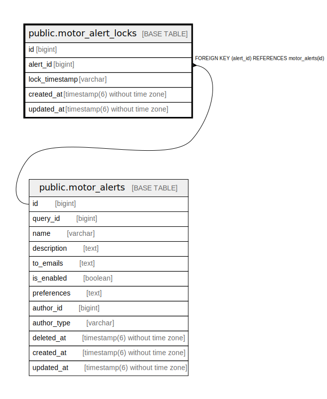

# public.motor_alert_locks

## Description

## Columns

| Name | Type | Default | Nullable | Children | Parents | Comment |
| ---- | ---- | ------- | -------- | -------- | ------- | ------- |
| id | bigint | nextval('motor_alert_locks_id_seq'::regclass) | false |  |  |  |
| alert_id | bigint |  | false |  | [public.motor_alerts](public.motor_alerts.md) |  |
| lock_timestamp | varchar |  | false |  |  |  |
| created_at | timestamp(6) without time zone |  | false |  |  |  |
| updated_at | timestamp(6) without time zone |  | false |  |  |  |

## Constraints

| Name | Type | Definition |
| ---- | ---- | ---------- |
| fk_rails_38d1b2960e | FOREIGN KEY | FOREIGN KEY (alert_id) REFERENCES motor_alerts(id) |
| motor_alert_locks_pkey | PRIMARY KEY | PRIMARY KEY (id) |

## Indexes

| Name | Definition |
| ---- | ---------- |
| motor_alert_locks_pkey | CREATE UNIQUE INDEX motor_alert_locks_pkey ON public.motor_alert_locks USING btree (id) |
| index_motor_alert_locks_on_alert_id | CREATE INDEX index_motor_alert_locks_on_alert_id ON public.motor_alert_locks USING btree (alert_id) |
| index_motor_alert_locks_on_alert_id_and_lock_timestamp | CREATE UNIQUE INDEX index_motor_alert_locks_on_alert_id_and_lock_timestamp ON public.motor_alert_locks USING btree (alert_id, lock_timestamp) |

## Relations

---

> Generated by [tbls](https://github.com/k1LoW/tbls)
