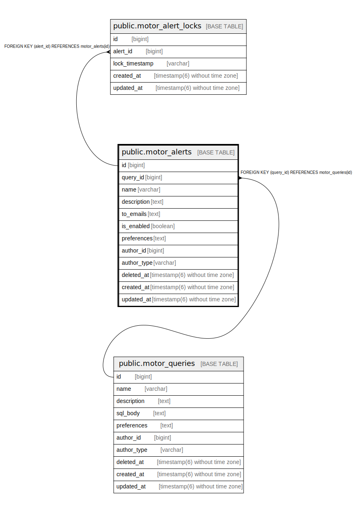

# public.motor_alerts

## Description

## Columns

| Name | Type | Default | Nullable | Children | Parents | Comment |
| ---- | ---- | ------- | -------- | -------- | ------- | ------- |
| id | bigint | nextval('motor_alerts_id_seq'::regclass) | false | [public.motor_alert_locks](public.motor_alert_locks.md) |  |  |
| query_id | bigint |  | false |  | [public.motor_queries](public.motor_queries.md) |  |
| name | varchar |  | false |  |  |  |
| description | text |  | true |  |  |  |
| to_emails | text |  | false |  |  |  |
| is_enabled | boolean | true | false |  |  |  |
| preferences | text |  | false |  |  |  |
| author_id | bigint |  | true |  |  |  |
| author_type | varchar |  | true |  |  |  |
| deleted_at | timestamp(6) without time zone |  | true |  |  |  |
| created_at | timestamp(6) without time zone |  | false |  |  |  |
| updated_at | timestamp(6) without time zone |  | false |  |  |  |

## Constraints

| Name | Type | Definition |
| ---- | ---- | ---------- |
| fk_rails_8828951644 | FOREIGN KEY | FOREIGN KEY (query_id) REFERENCES motor_queries(id) |
| motor_alerts_pkey | PRIMARY KEY | PRIMARY KEY (id) |

## Indexes

| Name | Definition |
| ---- | ---------- |
| motor_alerts_pkey | CREATE UNIQUE INDEX motor_alerts_pkey ON public.motor_alerts USING btree (id) |
| index_motor_alerts_on_query_id | CREATE INDEX index_motor_alerts_on_query_id ON public.motor_alerts USING btree (query_id) |
| index_motor_alerts_on_updated_at | CREATE INDEX index_motor_alerts_on_updated_at ON public.motor_alerts USING btree (updated_at) |
| motor_alerts_name_unique_index | CREATE UNIQUE INDEX motor_alerts_name_unique_index ON public.motor_alerts USING btree (name) WHERE (deleted_at IS NULL) |

## Relations

---

> Generated by [tbls](https://github.com/k1LoW/tbls)
