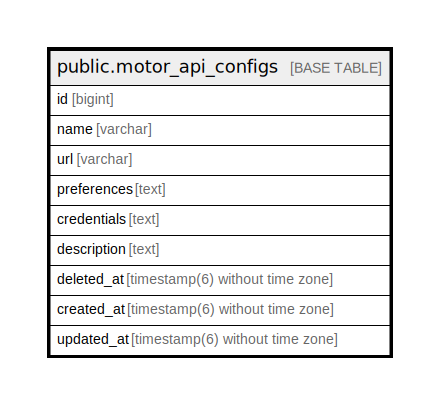

# public.motor_api_configs

## Description

## Columns

| Name | Type | Default | Nullable | Children | Parents | Comment |
| ---- | ---- | ------- | -------- | -------- | ------- | ------- |
| id | bigint | nextval('motor_api_configs_id_seq'::regclass) | false |  |  |  |
| name | varchar |  | false |  |  |  |
| url | varchar |  | false |  |  |  |
| preferences | text |  | false |  |  |  |
| credentials | text |  | false |  |  |  |
| description | text |  | true |  |  |  |
| deleted_at | timestamp(6) without time zone |  | true |  |  |  |
| created_at | timestamp(6) without time zone |  | false |  |  |  |
| updated_at | timestamp(6) without time zone |  | false |  |  |  |

## Constraints

| Name | Type | Definition |
| ---- | ---- | ---------- |
| motor_api_configs_pkey | PRIMARY KEY | PRIMARY KEY (id) |

## Indexes

| Name | Definition |
| ---- | ---------- |
| motor_api_configs_pkey | CREATE UNIQUE INDEX motor_api_configs_pkey ON public.motor_api_configs USING btree (id) |
| motor_api_configs_name_unique_index | CREATE UNIQUE INDEX motor_api_configs_name_unique_index ON public.motor_api_configs USING btree (name) WHERE (deleted_at IS NULL) |

## Relations

---

> Generated by [tbls](https://github.com/k1LoW/tbls)
