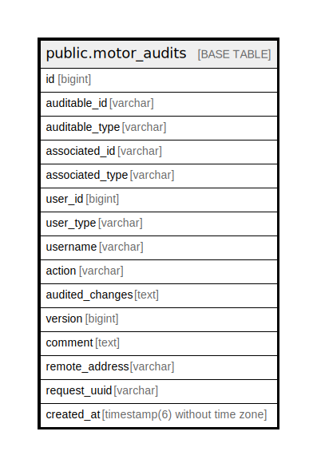

# public.motor_audits

## Description

## Columns

| Name | Type | Default | Nullable | Children | Parents | Comment |
| ---- | ---- | ------- | -------- | -------- | ------- | ------- |
| id | bigint | nextval('motor_audits_id_seq'::regclass) | false |  |  |  |
| auditable_id | varchar |  | true |  |  |  |
| auditable_type | varchar |  | true |  |  |  |
| associated_id | varchar |  | true |  |  |  |
| associated_type | varchar |  | true |  |  |  |
| user_id | bigint |  | true |  |  |  |
| user_type | varchar |  | true |  |  |  |
| username | varchar |  | true |  |  |  |
| action | varchar |  | true |  |  |  |
| audited_changes | text |  | true |  |  |  |
| version | bigint | 0 | true |  |  |  |
| comment | text |  | true |  |  |  |
| remote_address | varchar |  | true |  |  |  |
| request_uuid | varchar |  | true |  |  |  |
| created_at | timestamp(6) without time zone |  | true |  |  |  |

## Constraints

| Name | Type | Definition |
| ---- | ---- | ---------- |
| motor_audits_pkey | PRIMARY KEY | PRIMARY KEY (id) |

## Indexes

| Name | Definition |
| ---- | ---------- |
| motor_audits_pkey | CREATE UNIQUE INDEX motor_audits_pkey ON public.motor_audits USING btree (id) |
| motor_auditable_index | CREATE INDEX motor_auditable_index ON public.motor_audits USING btree (auditable_type, auditable_id, version) |
| motor_auditable_associated_index | CREATE INDEX motor_auditable_associated_index ON public.motor_audits USING btree (associated_type, associated_id) |
| motor_auditable_user_index | CREATE INDEX motor_auditable_user_index ON public.motor_audits USING btree (user_id, user_type) |
| index_motor_audits_on_request_uuid | CREATE INDEX index_motor_audits_on_request_uuid ON public.motor_audits USING btree (request_uuid) |
| index_motor_audits_on_created_at | CREATE INDEX index_motor_audits_on_created_at ON public.motor_audits USING btree (created_at) |

## Relations

---

> Generated by [tbls](https://github.com/k1LoW/tbls)
