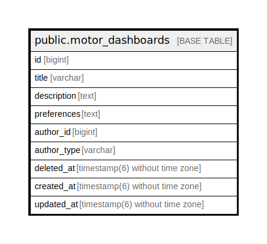

# public.motor_dashboards

## Description

## Columns

| Name | Type | Default | Nullable | Children | Parents | Comment |
| ---- | ---- | ------- | -------- | -------- | ------- | ------- |
| id | bigint | nextval('motor_dashboards_id_seq'::regclass) | false |  |  |  |
| title | varchar |  | false |  |  |  |
| description | text |  | true |  |  |  |
| preferences | text |  | false |  |  |  |
| author_id | bigint |  | true |  |  |  |
| author_type | varchar |  | true |  |  |  |
| deleted_at | timestamp(6) without time zone |  | true |  |  |  |
| created_at | timestamp(6) without time zone |  | false |  |  |  |
| updated_at | timestamp(6) without time zone |  | false |  |  |  |

## Constraints

| Name | Type | Definition |
| ---- | ---- | ---------- |
| motor_dashboards_pkey | PRIMARY KEY | PRIMARY KEY (id) |

## Indexes

| Name | Definition |
| ---- | ---------- |
| motor_dashboards_pkey | CREATE UNIQUE INDEX motor_dashboards_pkey ON public.motor_dashboards USING btree (id) |
| index_motor_dashboards_on_updated_at | CREATE INDEX index_motor_dashboards_on_updated_at ON public.motor_dashboards USING btree (updated_at) |
| motor_dashboards_title_unique_index | CREATE UNIQUE INDEX motor_dashboards_title_unique_index ON public.motor_dashboards USING btree (title) WHERE (deleted_at IS NULL) |

## Relations

---

> Generated by [tbls](https://github.com/k1LoW/tbls)
