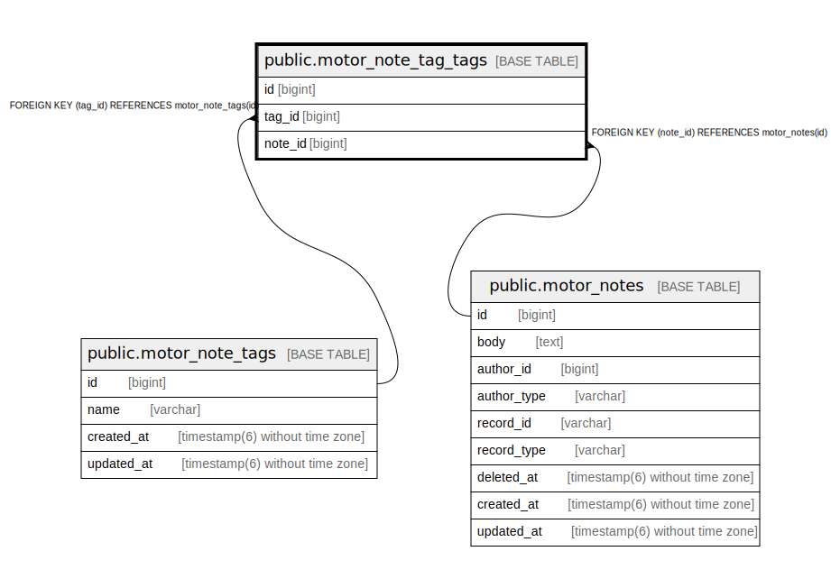

# public.motor_note_tag_tags

## Description

## Columns

| Name | Type | Default | Nullable | Children | Parents | Comment |
| ---- | ---- | ------- | -------- | -------- | ------- | ------- |
| id | bigint | nextval('motor_note_tag_tags_id_seq'::regclass) | false |  |  |  |
| tag_id | bigint |  | false |  | [public.motor_note_tags](public.motor_note_tags.md) |  |
| note_id | bigint |  | false |  | [public.motor_notes](public.motor_notes.md) |  |

## Constraints

| Name | Type | Definition |
| ---- | ---- | ---------- |
| fk_rails_5958bda098 | FOREIGN KEY | FOREIGN KEY (note_id) REFERENCES motor_notes(id) |
| fk_rails_f0bd88b67d | FOREIGN KEY | FOREIGN KEY (tag_id) REFERENCES motor_note_tags(id) |
| motor_note_tag_tags_pkey | PRIMARY KEY | PRIMARY KEY (id) |

## Indexes

| Name | Definition |
| ---- | ---------- |
| motor_note_tag_tags_pkey | CREATE UNIQUE INDEX motor_note_tag_tags_pkey ON public.motor_note_tag_tags USING btree (id) |
| index_motor_note_tag_tags_on_tag_id | CREATE INDEX index_motor_note_tag_tags_on_tag_id ON public.motor_note_tag_tags USING btree (tag_id) |
| motor_note_tags_note_id_tag_id_index | CREATE UNIQUE INDEX motor_note_tags_note_id_tag_id_index ON public.motor_note_tag_tags USING btree (note_id, tag_id) |

## Relations

---

> Generated by [tbls](https://github.com/k1LoW/tbls)
