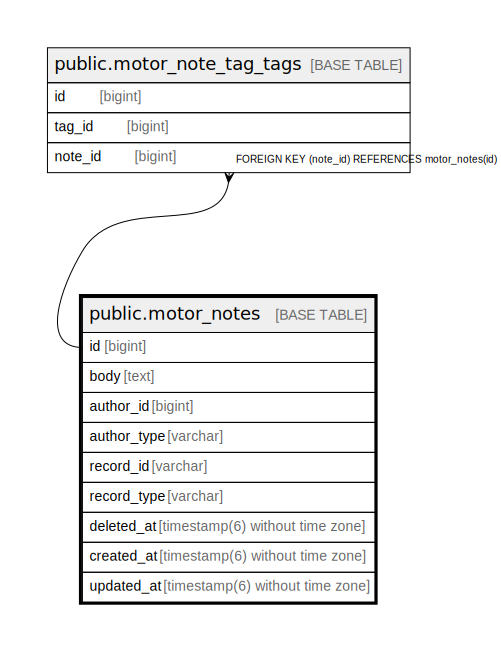

# public.motor_notes

## Description

## Columns

| Name | Type | Default | Nullable | Children | Parents | Comment |
| ---- | ---- | ------- | -------- | -------- | ------- | ------- |
| id | bigint | nextval('motor_notes_id_seq'::regclass) | false | [public.motor_note_tag_tags](public.motor_note_tag_tags.md) |  |  |
| body | text |  | true |  |  |  |
| author_id | bigint |  | true |  |  |  |
| author_type | varchar |  | true |  |  |  |
| record_id | varchar |  | false |  |  |  |
| record_type | varchar |  | false |  |  |  |
| deleted_at | timestamp(6) without time zone |  | true |  |  |  |
| created_at | timestamp(6) without time zone |  | false |  |  |  |
| updated_at | timestamp(6) without time zone |  | false |  |  |  |

## Constraints

| Name | Type | Definition |
| ---- | ---- | ---------- |
| motor_notes_pkey | PRIMARY KEY | PRIMARY KEY (id) |

## Indexes

| Name | Definition |
| ---- | ---------- |
| motor_notes_pkey | CREATE UNIQUE INDEX motor_notes_pkey ON public.motor_notes USING btree (id) |
| motor_notes_record_id_record_type_index | CREATE INDEX motor_notes_record_id_record_type_index ON public.motor_notes USING btree (record_id, record_type) |
| motor_notes_author_id_author_type_index | CREATE INDEX motor_notes_author_id_author_type_index ON public.motor_notes USING btree (author_id, author_type) |

## Relations

---

> Generated by [tbls](https://github.com/k1LoW/tbls)
