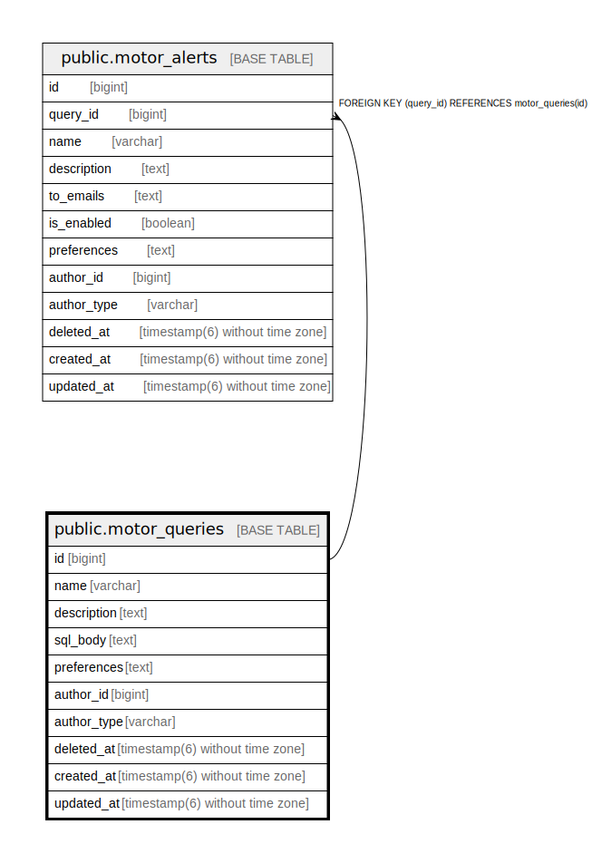

# public.motor_queries

## Description

## Columns

| Name | Type | Default | Nullable | Children | Parents | Comment |
| ---- | ---- | ------- | -------- | -------- | ------- | ------- |
| id | bigint | nextval('motor_queries_id_seq'::regclass) | false | [public.motor_alerts](public.motor_alerts.md) |  |  |
| name | varchar |  | false |  |  |  |
| description | text |  | true |  |  |  |
| sql_body | text |  | false |  |  |  |
| preferences | text |  | false |  |  |  |
| author_id | bigint |  | true |  |  |  |
| author_type | varchar |  | true |  |  |  |
| deleted_at | timestamp(6) without time zone |  | true |  |  |  |
| created_at | timestamp(6) without time zone |  | false |  |  |  |
| updated_at | timestamp(6) without time zone |  | false |  |  |  |

## Constraints

| Name | Type | Definition |
| ---- | ---- | ---------- |
| motor_queries_pkey | PRIMARY KEY | PRIMARY KEY (id) |

## Indexes

| Name | Definition |
| ---- | ---------- |
| motor_queries_pkey | CREATE UNIQUE INDEX motor_queries_pkey ON public.motor_queries USING btree (id) |
| index_motor_queries_on_updated_at | CREATE INDEX index_motor_queries_on_updated_at ON public.motor_queries USING btree (updated_at) |
| motor_queries_name_unique_index | CREATE UNIQUE INDEX motor_queries_name_unique_index ON public.motor_queries USING btree (name) WHERE (deleted_at IS NULL) |

## Relations

---

> Generated by [tbls](https://github.com/k1LoW/tbls)
