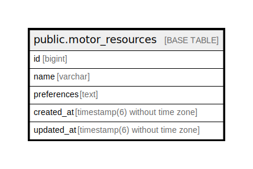

# public.motor_resources

## Description

## Columns

| Name | Type | Default | Nullable | Children | Parents | Comment |
| ---- | ---- | ------- | -------- | -------- | ------- | ------- |
| id | bigint | nextval('motor_resources_id_seq'::regclass) | false |  |  |  |
| name | varchar |  | false |  |  |  |
| preferences | text |  | false |  |  |  |
| created_at | timestamp(6) without time zone |  | false |  |  |  |
| updated_at | timestamp(6) without time zone |  | false |  |  |  |

## Constraints

| Name | Type | Definition |
| ---- | ---- | ---------- |
| motor_resources_pkey | PRIMARY KEY | PRIMARY KEY (id) |

## Indexes

| Name | Definition |
| ---- | ---------- |
| motor_resources_pkey | CREATE UNIQUE INDEX motor_resources_pkey ON public.motor_resources USING btree (id) |
| index_motor_resources_on_name | CREATE UNIQUE INDEX index_motor_resources_on_name ON public.motor_resources USING btree (name) |
| index_motor_resources_on_updated_at | CREATE INDEX index_motor_resources_on_updated_at ON public.motor_resources USING btree (updated_at) |

## Relations

---

> Generated by [tbls](https://github.com/k1LoW/tbls)
