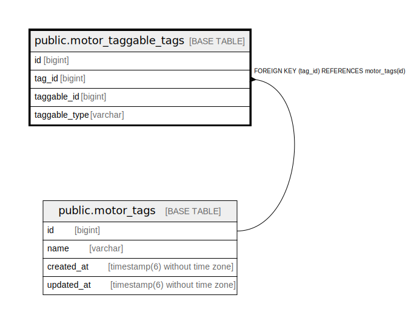

# public.motor_taggable_tags

## Description

## Columns

| Name | Type | Default | Nullable | Children | Parents | Comment |
| ---- | ---- | ------- | -------- | -------- | ------- | ------- |
| id | bigint | nextval('motor_taggable_tags_id_seq'::regclass) | false |  |  |  |
| tag_id | bigint |  | false |  | [public.motor_tags](public.motor_tags.md) |  |
| taggable_id | bigint |  | false |  |  |  |
| taggable_type | varchar |  | false |  |  |  |

## Constraints

| Name | Type | Definition |
| ---- | ---- | ---------- |
| fk_rails_ba9ebe2280 | FOREIGN KEY | FOREIGN KEY (tag_id) REFERENCES motor_tags(id) |
| motor_taggable_tags_pkey | PRIMARY KEY | PRIMARY KEY (id) |

## Indexes

| Name | Definition |
| ---- | ---------- |
| motor_taggable_tags_pkey | CREATE UNIQUE INDEX motor_taggable_tags_pkey ON public.motor_taggable_tags USING btree (id) |
| index_motor_taggable_tags_on_tag_id | CREATE INDEX index_motor_taggable_tags_on_tag_id ON public.motor_taggable_tags USING btree (tag_id) |
| motor_polymorphic_association_tag_index | CREATE UNIQUE INDEX motor_polymorphic_association_tag_index ON public.motor_taggable_tags USING btree (taggable_id, taggable_type, tag_id) |

## Relations

---

> Generated by [tbls](https://github.com/k1LoW/tbls)
