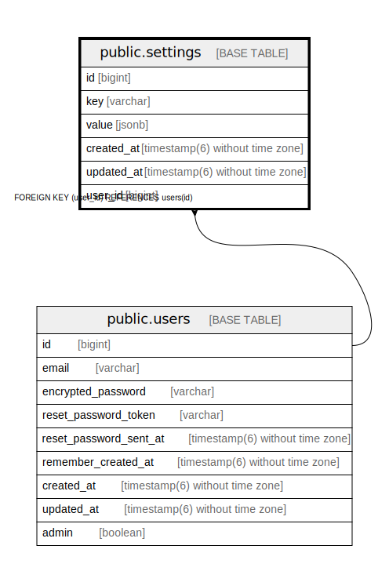

# public.settings

## Description

## Columns

| Name | Type | Default | Nullable | Children | Parents | Comment |
| ---- | ---- | ------- | -------- | -------- | ------- | ------- |
| id | bigint | nextval('settings_id_seq'::regclass) | false |  |  |  |
| key | varchar |  | true |  |  |  |
| value | jsonb |  | true |  |  |  |
| created_at | timestamp(6) without time zone |  | false |  |  |  |
| updated_at | timestamp(6) without time zone |  | false |  |  |  |
| user_id | bigint |  | true |  | [public.users](public.users.md) |  |

## Constraints

| Name | Type | Definition |
| ---- | ---- | ---------- |
| fk_rails_5676777bf1 | FOREIGN KEY | FOREIGN KEY (user_id) REFERENCES users(id) |
| settings_pkey | PRIMARY KEY | PRIMARY KEY (id) |

## Indexes

| Name | Definition |
| ---- | ---------- |
| settings_pkey | CREATE UNIQUE INDEX settings_pkey ON public.settings USING btree (id) |
| index_settings_on_user_id | CREATE INDEX index_settings_on_user_id ON public.settings USING btree (user_id) |

## Relations

---

> Generated by [tbls](https://github.com/k1LoW/tbls)
