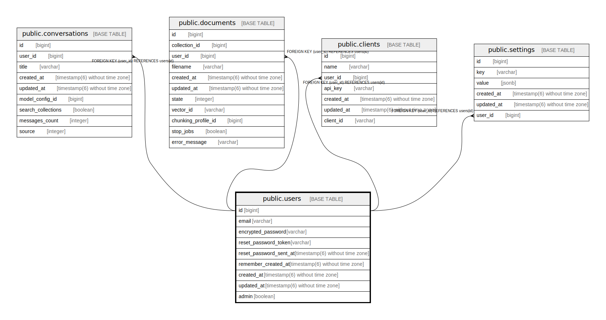

# public.users

## Description

## Columns

| Name | Type | Default | Nullable | Children | Parents | Comment |
| ---- | ---- | ------- | -------- | -------- | ------- | ------- |
| id | bigint | nextval('users_id_seq'::regclass) | false | [public.conversations](public.conversations.md) [public.documents](public.documents.md) [public.clients](public.clients.md) [public.settings](public.settings.md) |  |  |
| email | varchar | ''::character varying | false |  |  |  |
| encrypted_password | varchar | ''::character varying | false |  |  |  |
| reset_password_token | varchar |  | true |  |  |  |
| reset_password_sent_at | timestamp(6) without time zone |  | true |  |  |  |
| remember_created_at | timestamp(6) without time zone |  | true |  |  |  |
| created_at | timestamp(6) without time zone |  | false |  |  |  |
| updated_at | timestamp(6) without time zone |  | false |  |  |  |
| admin | boolean | false | false |  |  |  |

## Constraints

| Name | Type | Definition |
| ---- | ---- | ---------- |
| users_pkey | PRIMARY KEY | PRIMARY KEY (id) |

## Indexes

| Name | Definition |
| ---- | ---------- |
| users_pkey | CREATE UNIQUE INDEX users_pkey ON public.users USING btree (id) |
| index_users_on_email | CREATE UNIQUE INDEX index_users_on_email ON public.users USING btree (email) |
| index_users_on_reset_password_token | CREATE UNIQUE INDEX index_users_on_reset_password_token ON public.users USING btree (reset_password_token) |

## Relations

---

> Generated by [tbls](https://github.com/k1LoW/tbls)
